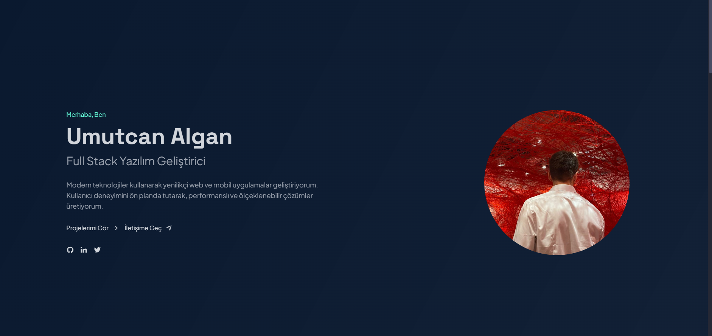

# Personal Portfolio Website

A modern, responsive personal portfolio website built with the latest web technologies. Features a coding-themed 3D background, dark/light mode support, and smooth animations.



## 🌟 Features

- **Modern Design**: Clean, professional, and responsive design that works on all devices
- **3D Coding Theme Background**: Interactive particle animation using Three.js
- **Dark/Light Mode**: Toggle between dark and light themes with persistent preferences
- **Smooth Animations**: GSAP-powered animations for a polished user experience
- **Intersection Observer API**: Performance-optimized scroll animations
- **Responsive Layout**: Fully responsive design using Tailwind CSS
- **Modular Architecture**: Clean code organization using ES Modules

## 🚀 Technologies

### Core Technologies
- HTML5
- CSS3 with Tailwind CSS
- JavaScript (ES6+)

### Libraries & Frameworks
- [Three.js](https://threejs.org/) - 3D Background Animation
- [GSAP](https://greensock.com/gsap/) - Advanced Animations
- [Chart.js](https://www.chartjs.org/) - Interactive Skill Visualization
- [Tailwind CSS](https://tailwindcss.com/) - Utility-first CSS Framework
- [Remix Icons](https://remixicon.com/) - Modern Icon Set
- [Vite](https://vitejs.dev/) - Next Generation Frontend Tooling

## 📋 Project Structure

```
personalWeb/
├── animations.js         # GSAP animations
├── background3d.js       # Three.js 3D background
├── images/               # Image assets
├── index.html            # Main HTML file
├── main.js               # Main JavaScript entry point
├── package.json          # Project dependencies
├── style.css             # Main stylesheet
├── theme.js              # Dark/light theme functionality
├── vite.config.js        # Vite configuration
└── README.md             # Project documentation
```

## 🛠️ Installation & Setup

1. Clone the repository:
```bash
git clone https://github.com/ucanalgan/personalWeb.git
```

2. Navigate to the project directory:
```bash
cd personalWeb
```

3. Install dependencies:
```bash
npm install
```

4. Start the development server:
```bash
npm run dev
```

5. Open your browser and visit `http://localhost:3000`

### Building for Production

```bash
npm run build
```

This will create a `dist` directory with optimized production files.

## 🧩 Customization

### Changing the Theme Colors

Edit the Tailwind configuration in the `tailwind.config.js` file:

```js
module.exports = {
  theme: {
    extend: {
      colors: {
        primary: '#64ffda',    // Change the primary color
        secondary: '#0a192f',  // Change the secondary color
        dark: '#0a192f',       // Dark theme background
        light: '#f8f9fa'       // Light theme background
      }
    }
  }
}
```

### Updating the 3D Background

Modify the `background3d.js` file to customize the 3D particles effect:

```js
// Change color options for particles
const colorOptions = [
  new THREE.Color('#64ffda').convertSRGBToLinear(),
  new THREE.Color('#4dffa0').convertSRGBToLinear(),
  new THREE.Color('#00ff9d').convertSRGBToLinear()
];

// Adjust particle count
const particlesCount = 1200; // Increase or decrease as needed
```

## 🤝 Contributing

Contributions are welcome! Here's how you can contribute:

1. Fork the repository
2. Create a new branch: `git checkout -b feature/amazing-feature`
3. Make your changes
4. Commit your changes: `git commit -m 'Add amazing feature'`
5. Push to the branch: `git push origin feature/amazing-feature`
6. Open a Pull Request

## 📄 License

This project is licensed under the MIT License - see the [LICENSE](LICENSE) file for details.

## 📬 Contact

Umutcan Algan - [GitHub](https://github.com/ucanalgan) - [LinkedIn](https://www.linkedin.com/in/umutcan-algan/) - umutcanalgan91@gmail.com

Project Link: [https://github.com/ucanalgan/personalWeb](https://github.com/ucanalgan/personalWeb)